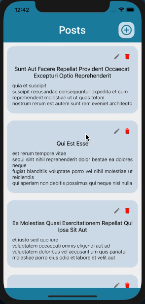

> # Redux Reducer Assignment

> ### List Resource: https://jsonplaceholder.typicode.com/posts
>
> ### Update Resource: https://jsonplaceholder.typicode.com/posts/1
>
> ### Add Resource: https://jsonplaceholder.typicode.com/posts
>
> ### Delete Resource: https://jsonplaceholder.typicode.com/posts/1
>
> ### [Guide](https://jsonplaceholder.typicode.com/guide/)
>
> - ### Create a Listing screen with add icon on top right.
>
> - ### Each List will have edit and delete icon use the respective API's.
>
> - ### All API's need to implemented through redux.

> ### Output:
>
> </img>
